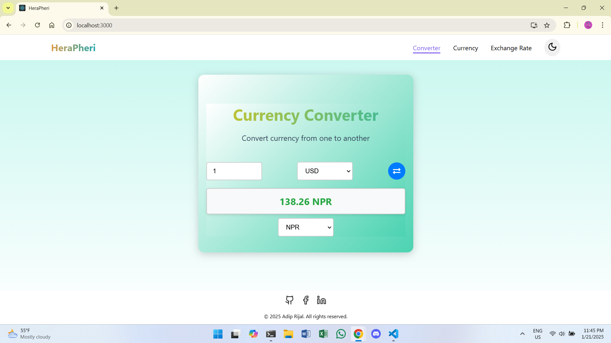

# HeraPheri (Currency Converter App)

A responsive and user-friendly Currency Converter web application built with **React.js**. This app allows users to convert between different currencies using real-time exchange rates with a sleek UI and dark mode support.

---

## Features

- 💵 **Real-Time Currency Conversion**
- 🔍 **Live Exchange Rates via API Integration**
- 🌟 **User-Friendly and Responsive UI**
- 🌙 **Dark Mode Toggle for Better Accessibility**
- ⬆️⬇️ **Dropdowns for Selecting Currencies**

---

## Tech Stack

- **Frontend:** React.js, CSS
- **API:** [ExchangeRate API](https://api.exchangerate-api.com/)
- **Package Manager:** npm

---

## Installation and Setup

1. **Clone the Repository:**
   ```bash
   git clone https://github.com/adiprijal/Currency-Converter.git
   cd Currency-Converter
   ```

2. **Install Dependencies:**
   ```bash
   npm install
   ```

3. **Run the App:**
   ```bash
   npm start
   ```
   The app will run at `http://localhost:3000`.

4. **Build for Productions:**
   ```bash
   npm run build
   ```

---

## Usage

1. **Enter the amount** you want to convert.
2. **Select the currencies** from the dropdowns.
3. Click the **Convert** button to see the result.
4. Toggle **Dark Mode** for a different UI theme.

---

## Folder Structure

```
herapheri/
├── public/
│   ├── index.html
│   └── favicon.ico
├── src/
│   ├── components/
│   │   ├── Layout/
│   │   │   ├── Footer.jsx
│   │   │   ├── Footer.module.jsx
│   │   │   ├── Navbar.css
│   │   │   └── Navbar.module.css
│   │   └── shared/
│   │       ├── PageTransition.jsx
│   │       ├── PageTransition.module.jsx
│   │       ├── SectionTitle.jsx
│   │       └── SectionTitle.module.css
│   ├── context/
│   │       ├── currency.json
│   │       └── ThemeContext.js
│   ├── images/
│   │       ├── logo.svg
│   │       └── light-mode.png
│   ├── pages/
│   │   ├── Converter.jsx
│   │   ├── Converter.css
│   │   ├── Currency.jsx
│   │   ├── Currency.module.css
│   │   ├── ExchangeRate.jsx
│   │   └── ExchangeRate.module.css
│   ├── App.jsx
│   ├── App.module.css
│   ├── index.js
│   └── index.css
├── package.json
├── .gitignore
└── README.md
```

---

## Screenshots

### Light Mode


### Dark Mode


---

## API Reference

- **Base URL:** `https://api.exchangerate-api.com/v4/latest/{currency}`
- **Example:** Convert from USD to NPR
  ```bash
  https://api.exchangerate-api.com/v4/latest/USD
  ```

---

## Contributing

1. Fork the repository.
2. Create your feature branch:
   ```bash
   git checkout -b feature/YourFeature
   ```
3. Commit your changes:
   ```bash
   git commit -m "Add your feature"
   ```
4. Push to the branch:
   ```bash
   git push origin feature/YourFeature
   ```
5. Open a pull request.

---

## License

This project is licensed under the [MIT License](LICENSE).

---

## Contact

For any inquiries or suggestions, feel free to contact:

**Adip Rijal**  
Email: [pas081bct005@wrc.edu.np](mailto:pas081bct005@wrc.edu.np)  
GitHub: [adiprijal](https://github.com/adiprijal)

---

Enjoy using the Currency Converter App! 📈